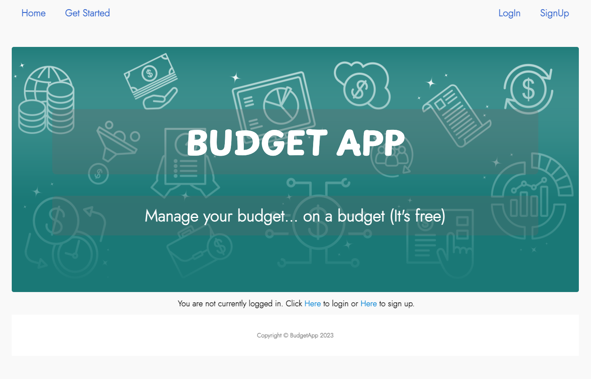
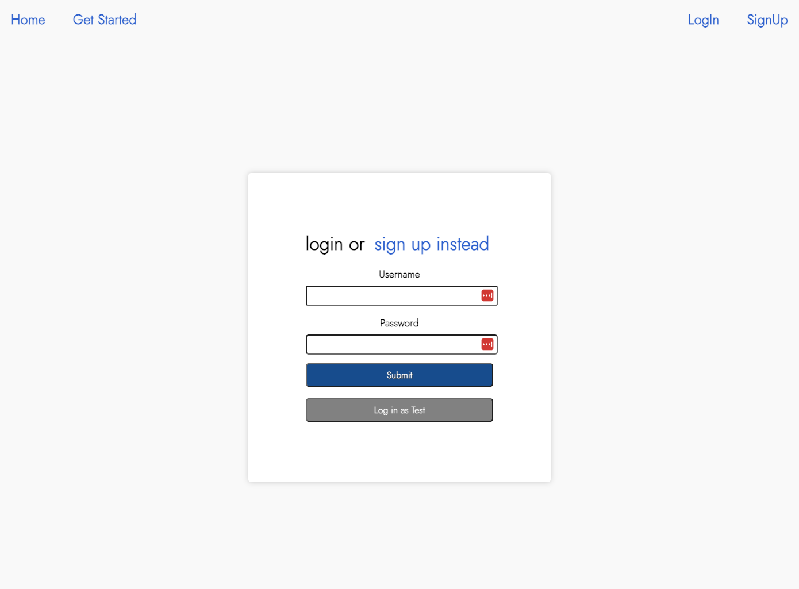
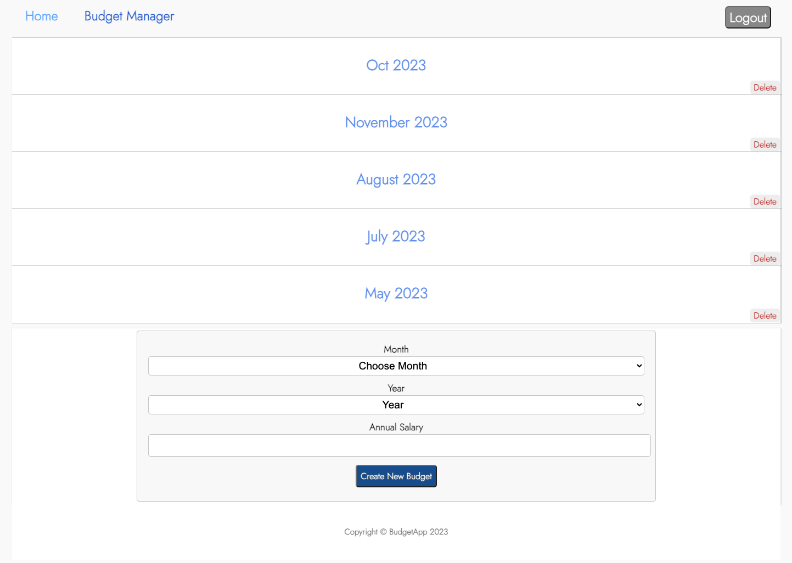
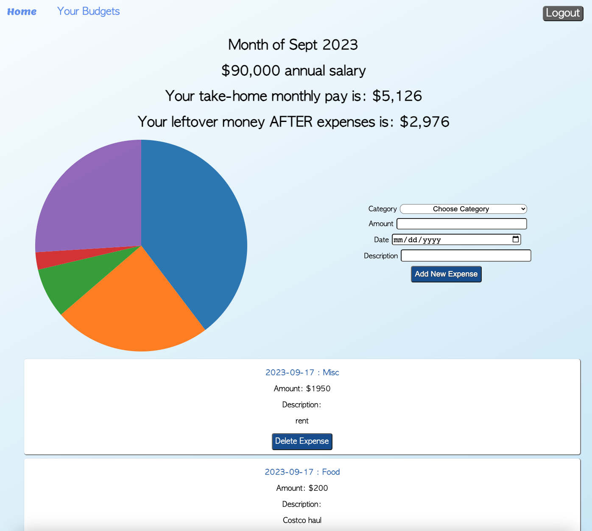

### Budget App

[Video Link](https://www.youtube.com/watch?v=RHNEqIbuxw8)

- Full-Stack application allowing users to manage their monthly budgets and expenses.
- Pie chart programmed and displayed dynamically for data visualization (D3.js) for paycheck calculations and info.
- Technologies Used: Javascript, D3.js, React.js, HTML, CSS, Webpack, Ruby, Rails, PostgreSQL.	

Directions:
- Create an account.
- Access your budgets at the top left-corner at "Your Budgets".
- Create a budget by the month, enter the month and year, and annual salary. Your salary will then automatically be taxed based on how much money you make.
- Enter your budget page and see the breakdown of where your money is going.
- Then add your expenses, and at the end of the month, see how much take-home money you have left.

<h1>Home Greeting Page</h1>

 

    

 

<h1>Login/Signup Page</h1>

 

    

 

<h1>List of budgets</h1>

 

    

 

<h1>Budget and expense tracker with pie chart</h1>

 

    

 